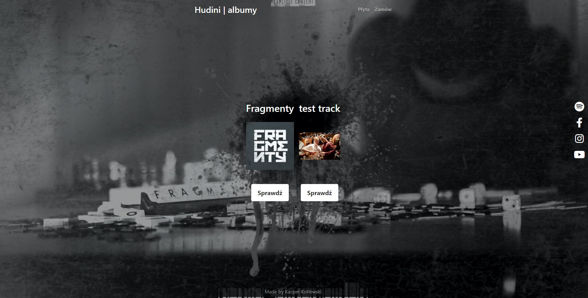
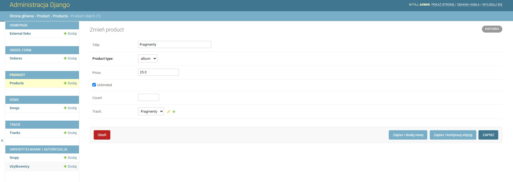
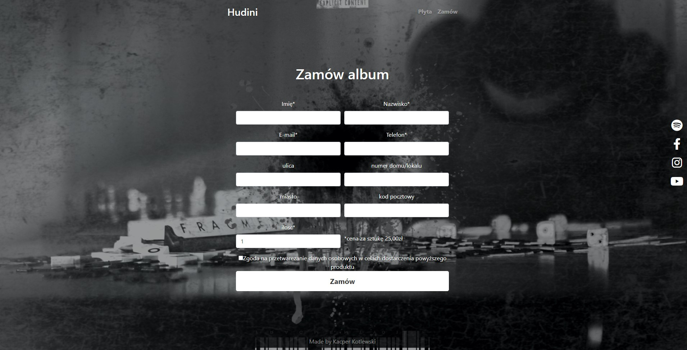
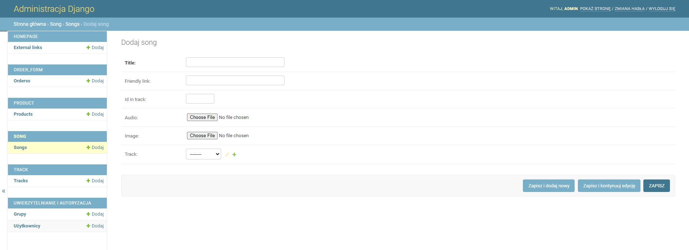

# django_page
this is a copy of page made for Hudini, as a commercial one, but he decided to stop working on that right now, we will continue work in the near future

[hosted page here](http://www.bassmood.pl/)

I make many features in such a projeckt but we use around 4 in current state

## how to run project
in terminal:
```
git clone https://github.com/KacperKotlewski/django_page
```
next you run files **```run.bat```** or **```run.sh```** depends of the system you use

after that in your browser enter on ```localhost:8000```

## admin panel
for this repo I create special superuser

>L: admin
>
>H: admin


### external links
in here you can easly add new external link on the side of the page, and add and icon from font awsome


### adding new tracks
**you can add new tracks to side easly as well**

image is a album cover

bg image is for changing image in background

after adding that you will se on [localhost:8000/track](http://localhost:8000/track) your newest added tracks





### products
after you add a track you need to register this as a product if you want to order it on side

after register you can press button "zamów teraz" on your track to go to order form


### songs
I add even an option to register your mp3 on page and listen that but my client decide to not use that feature

if you add one you can gat into this by enter to ```http://localhost:8000/track/<your tack name>/song```

